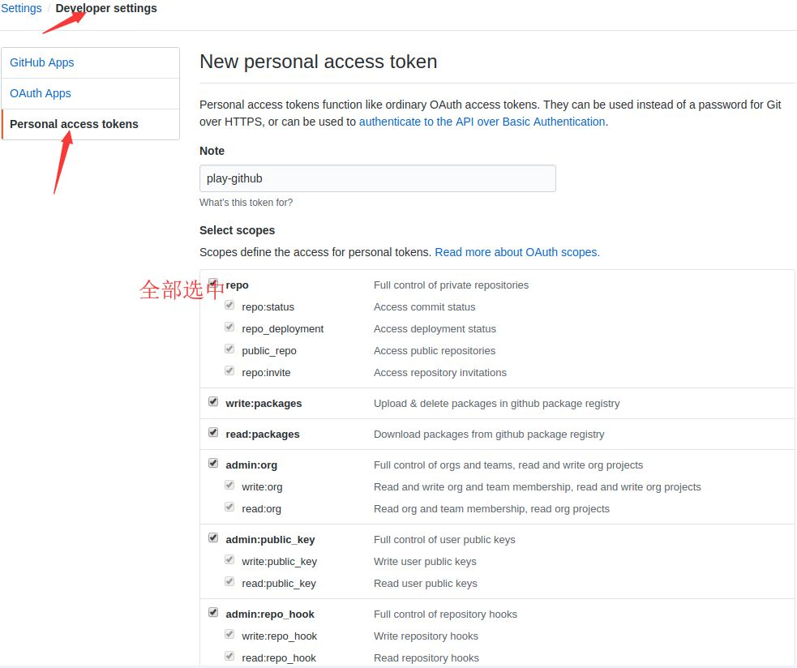
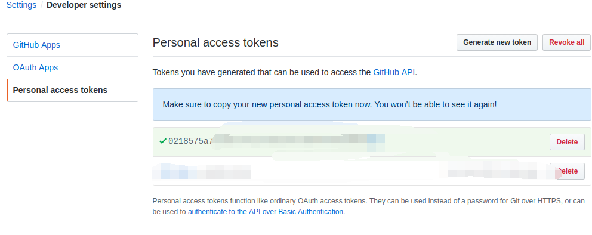
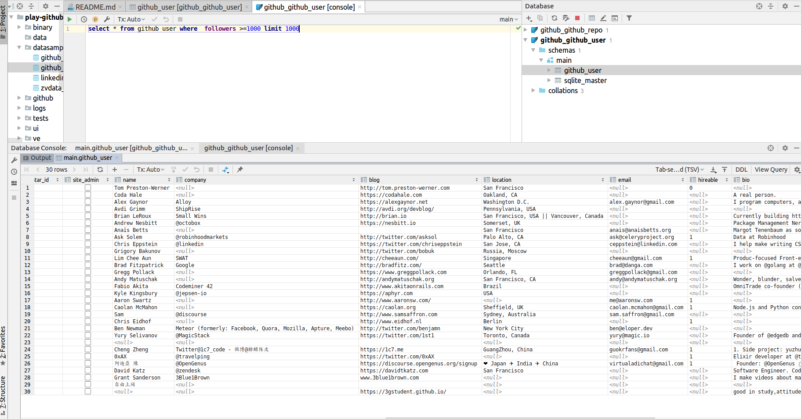
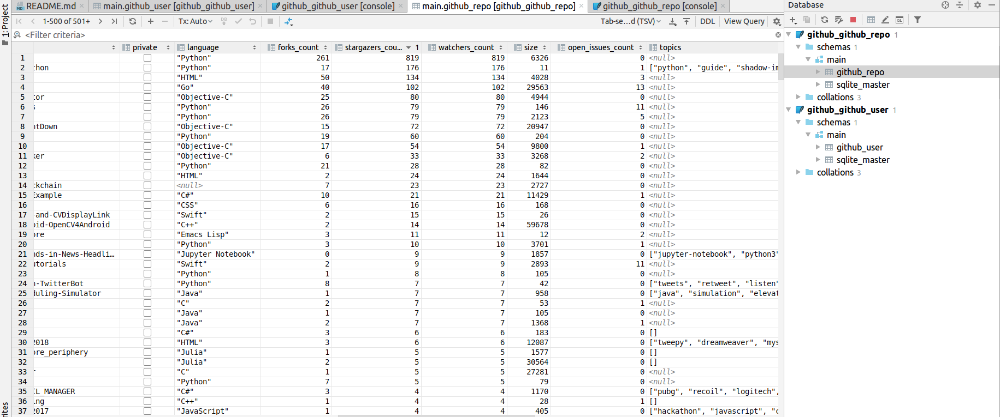
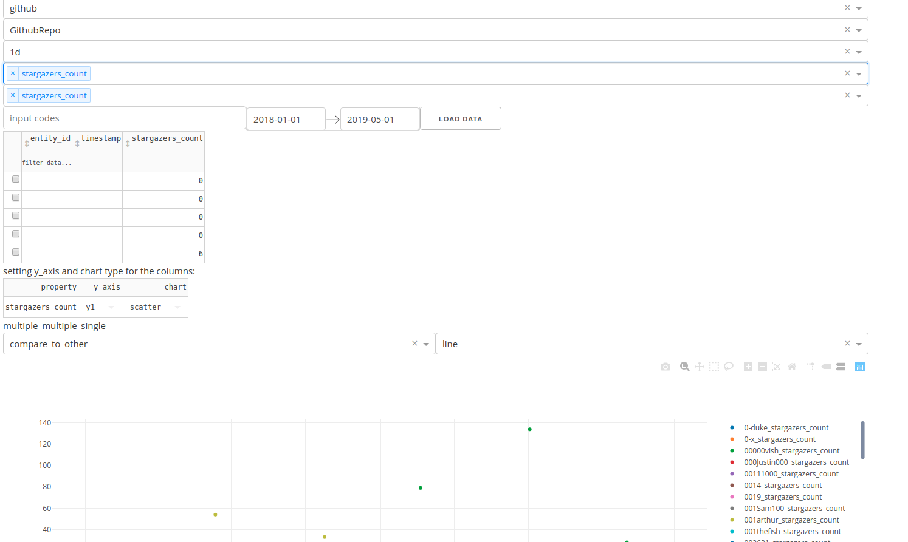

[](https://travis-ci.org/zvtvz/play-github)
[](http://hits.dwyl.io/zvtvz/play-github)

**其他语言: [english](README-en.md).**  

play-github 是使用 [**zvdata**](https://github.com/zvtvz/zvdata) 和 [**github api**](https://developer.github.com/v3/)
来自动把玩github的一个python程序。


# 功能

- 抓取全量的github用户
- 抓取所有的repo
- 自动follow用户
- 自动star repo

# 设置

- python3.6以上，并安装项目的requirements（推荐使用virtual env）

- 获取github token





- 把token放到token池里面

设置[**github account**](./github/accounts/github_account.py)
```python

class GithubAccount(object):
    tokens = ['xxxxxxx']

```

# 示范

## 数据抓取

>可下载数据文件并解压到datasample目录，然后接着抓

>链接: https://pan.baidu.com/s/125mi5mQEGqtDveoZfsviPw 提取码: 79m8

>数据的抓取是增量的，可断点续抓

### 抓取全量用户列表
```python
python github/recorders/github/github_user_list_recorder.py 
```

### 抓取用户详细信息
```python
python github/recorders/github/github_user_info_recorder.py --start 2015-01-01 --end 2015-12-31
```

###  抓取用户的repo
```python
python github/recorders/github/github_repo_recorder.py --start 2015-01-01 --end 2015-12-31
```

> start,end代表用户注册的时间，开多个进程，指定start和end加快抓取速度

### 数据查看
datasample目录里面的db文件






## api使用

数据抓取后，自动获得api能力

### 查询用户
```python
In [2]: from github import *                                                                                                                                                             

In [3]: from zvdata.api import *                                                                                                                                                         

In [4]: df=get_entities(provider='github',entity_type='github_user',limit=500)                                                                                                           

In [5]: df                                                                                                                                                                               
Out[5]: 
                                          id                    entity_id  timestamp  entity_type exchange             code          created_timestamp          updated_timestamp                           node_id                                         avatar_url gravatar_id site_admin                 name    company                blog                           location                       email hireable                                                bio  public_repos  public_gists  followers  following
code                                                                                                                                                                                                                                                                                                                                                                                                                                                                                                                          
-ACE-                      user_github_-ACE-            user_github_-ACE- 2009-03-24  github_user   github            -ACE- 2019-07-17 12:09:19.585328 2019-08-07 13:05:37.822756                  MDQ6VXNlcjY2MjUy  https://avatars1.githubusercontent.com/u/66252...                  False                 None       None                                                   None                        None     None                                               None           0.0           0.0        5.0        0.0
-Cor-                      user_github_-Cor-            user_github_-Cor- 2009-06-17  github_user   github            -Cor- 2019-07-17 12:33:36.103707 2019-08-07 13:05:40.895008                  MDQ6VXNlcjk2Mjg3  https://avatars2.githubusercontent.com/u/96287...                  False                 None       None                                                   None                        None     None                                               None           0.0           0.0        4.0        0.0
-DNA-                      user_github_-DNA-            user_github_-DNA- 2009-03-27  github_user   github            -DNA- 2019-07-17 12:10:24.828284 2019-08-07 13:05:42.609203                  MDQ6VXNlcjY3NzY4  https://avatars3.githubusercontent.com/u/67768...                  False                 None       None                                                   None                        None     None                                               None           0.0           0.0        4.0        0.0
-Jerry-                  user_github_-Jerry-          user_github_-Jerry- 2009-01-04  github_user   github          -Jerry- 2019-07-17 11:50:14.143260 2019-08-07 13:06:18.678750                  MDQ6VXNlcjQ0MDcy  https://avatars0.githubusercontent.com/u/44072...                  False                 None       None                                                   None                        None     None                                               None           1.0           0.0        4.0        0.0
-Pheonix-              user_github_-Pheonix-        user_github_-Pheonix- 2009-01-14  github_user   github        -Pheonix- 2019-07-17 11:52:24.525745 2019-08-07 13:06:22.054885                  MDQ6VXNlcjQ2NDUz  https://avatars1.githubusercontent.com/u/46453...                  False                 None       None                                                   None                        None     None                                               None           0.0           0.0        6.0        0.0

```

### 查询repo
```python

In [10]: df = get_data(provider='github', data_schema=GithubRepo,filters=[GithubRepo.stargazers_count>100],limit=500)                                                                    

In [11]: df                                                                                                                                                                              
Out[11]: 
                                                         id             entity_id           timestamp          created_timestamp          updated_timestamp      code                           node_id               name                   full_name  private  language  forks_count  stargazers_count  watchers_count   size  open_issues_count                                             topics           pushed_at          created_at          updated_at subscribers_count network_count                                            license
timestamp                                                                                                                                                                                                                                                                                                                                                                                                                                                                                                                                           
2016-10-15 12:53:36              user_github_01Sr_fchinanet      user_github_01Sr 2016-10-15 12:53:36 2019-08-08 09:31:06.595625 2019-08-08 09:32:58.745826      01Sr  MDEwOlJlcG9zaXRvcnk3MDk4NzY4Ng==          fchinanet              01Sr/fchinanet    False      "Go"           40               102             102  29563                 13                                               None 2018-05-14 10:18:08 2016-10-15 12:53:36 2019-07-10 06:27:51              None          None                                               None
2017-08-02 05:43:22  user_github_00111000_Imports-in-Python  user_github_00111000 2017-08-02 05:43:22 2019-08-07 16:14:46.918615 2019-09-21 09:40:07.381597  00111000  MDEwOlJlcG9zaXRvcnk5OTA3NjY1Mw==  Imports-in-Python  00111000/Imports-in-Python    False  "Python"           17               176             176     11                  1  ["python", "guide", "shadow-imports", "python-... 2017-08-05 02:00:26 2017-08-02 05:43:22 2019-05-23 02:18:13              None          None                                               None
2017-09-27 05:58:38         user_github_foolcage_fooltrader  user_github_foolcage 2017-09-27 05:58:38 2019-08-07 16:02:05.898244 2019-08-07 16:02:08.557525  foolcage  MDEwOlJlcG9zaXRvcnkxMDQ5NzgwNTA=         fooltrader         foolcage/fooltrader    False  "Python"          261               819             819   6326                  0                                               None 2019-04-30 09:55:43 2017-09-27 05:58:38 2019-08-07 01:49:07              None          None  {"key": "mit", "name": "MIT License", "spdx_id...
2019-01-02 05:29:45               user_github_01ly_DPspider      user_github_01ly 2019-01-02 05:29:45 2019-08-08 09:31:06.595625 2019-08-08 09:33:21.268084      01ly  MDEwOlJlcG9zaXRvcnkxNjM3OTc4MjU=           DPspider               01ly/DPspider    False    "HTML"           50               134             134   4028                  3                                               None 2019-05-04 14:27:20 2019-01-02 05:29:45 2019-08-07 10:35:07              None          None  {"key": "mit", "name": "MIT License", "spdx_id...

```

### 自动follow和star

```bash
python github/follow.py 

INFO  MainThread  2019-09-21 10:57:15,777  apscheduler.scheduler:431  add_job  Adding job tentatively -- it will be properly scheduled when the scheduler starts
follow:wangzheng0822 ok
follow:sunfusheng ok
follow:rajayogan ok
follow:az0ne ok
follow:MurhafSousli ok
follow:romabelka ok
follow:PaulBatchelor ok
follow:MatthewPeterKelly ok
follow:sibirbil ok

```

```bash
python github/star.py 

star:02015678/RevokeChinaCerts ok
star:02047788a/TwoColumnListView ok
star:0-duke/wdpassport-utils ok
star:00buggy00/OpenGL-Swift-and-CVDisplayLink ok
star:007kevin/Accelerated_CPP ok
star:007kevin/ProjectEuler ok
star:01luisrene/Formulario-validado-JS ok
star:001Sam100/Release ok
star:041501218/Images ok
star:0000alex0000/project ok
star:0071naima/PUCMATP ok
star:001Sam100/TestGITHub ok
star:02047788a/SignInRPI ok
star:007kevin/AuctionWebsite ok
star:00I0712100/count01 ok
star:00I0712100/omikuji ok
star:00laneboy00/hello-world ok
star:00dingens/MyPaxosTests ok
star:04n0/ansible-playbooks ok
star:04n0/ansible-tuto ok

```
## 可视化数据

运行　[**数据可视化index程序**](./github/index.py)

```
python index.py
```



这里使用的是[**zvdata**](https://github.com/zvtvz/zvdata)自带的数据分析功能，其更多的使用可查看[**zvt**](https://github.com/zvtvz/zvt)如何用来做股市数据的分析。

本质上，zvdata是数据的抽象抓取和分析库，[**zvt**](https://github.com/zvtvz/zvt)　和　play-github是其具体使用的例子。

# 声明

play-github只是为了证明 [**zvdata**](https://github.com/zvtvz/zvdata) 通用性的一个例子，我的更多精力是在开发和维护 [**zvt**](https://github.com/zvtvz/zvt) 上，并会持续把一些通用的功能提到　zvdata上来。

如果你想开发和维护play-github，可与我联系。

# 联系方式  

微信　foolcage